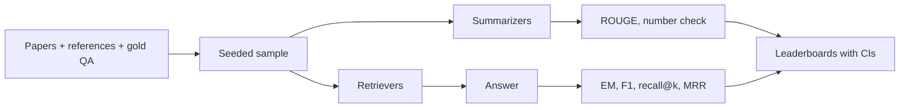
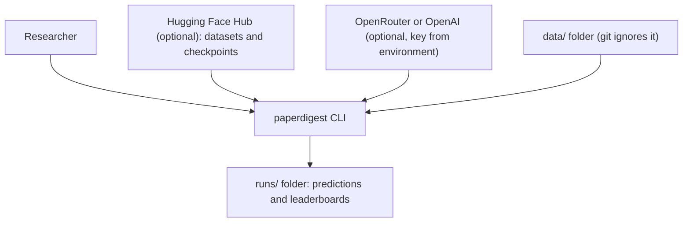
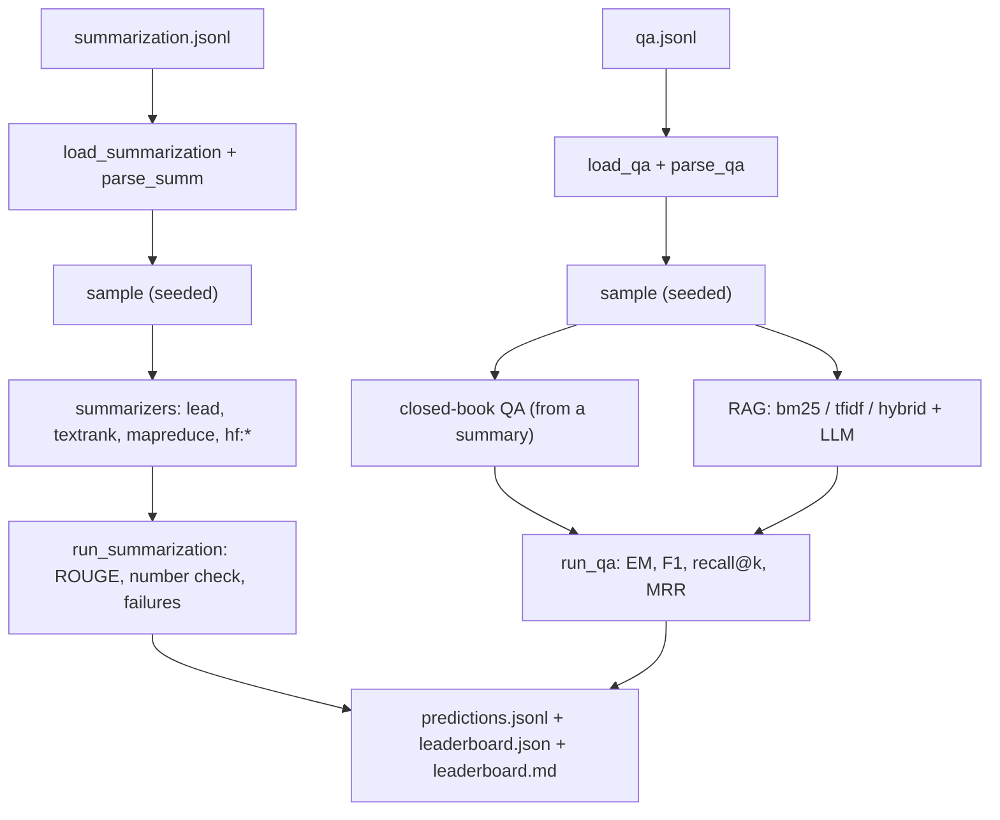

<div align="center">

# paperdigest — Reproducible Benchmark for Paper Summarization, QA and RAG

**paperdigest is an evaluation harness for researchers who compare ways to summarize research papers and answer questions about them. It takes papers with reference summaries and gold answers through these steps to leaderboards with confidence intervals:**

`load and sample` → `chunk` → `summarize or retrieve` → `answer` → `score` → `leaderboard`.


**[Summary](#1-summary)** ·
**[Workflow](#4-the-end-to-end-workflow)** ·
**[Run it](#14-how-to-run-paperdigest)** ·
**[Configuration](#144-environment-variables)** ·
**[Known problems](#17-known-problems)** ·
**[Glossary](#19-glossary)**

</div>

> [!NOTE]
> This README uses ASD-STE100 Simplified Technical English. The writing rules and the project
> vocabulary are in [`docs/ste-style-guide.md`](docs/ste-style-guide.md). Each term in the
> [Glossary](#19-glossary) has only one meaning.

---

paperdigest benchmarks 20 summarizers and 4 question-answering systems on research papers.
Each summary is scored against a real reference summary, never against a title. Each answer is scored against gold answers, and each retriever against gold evidence paragraphs.
Every score has a bootstrap confidence interval, and the two best summarizers get a paired comparison.
LLM calls are deterministic, retry on transient errors and raise an error on failure. A failure is recorded and never becomes summary text.
The offline path (extractive summarizers, BM25, TF-IDF and a deterministic fake LLM) runs the full benchmark with no key and no network.

This README is the **one location that explains all of paperdigest**. It gives these topics:

- the general design
- each component and its procedure, step by step
- the decision rules
- the data map
- the runbook
- the validation results and the known problems

| If you are… | Read |
|---|---|
| A manager or reviewer | [1](#1-summary), [3](#3-design-rules), [4](#4-the-end-to-end-workflow), [16](#16-validation-results), [18](#18-key-points) |
| A developer who joins the project | All sections, in sequence. Keep [14](#14-how-to-run-paperdigest) and [17](#17-known-problems) open while you work |
| A researcher who runs paperdigest | [14](#14-how-to-run-paperdigest), then the section for the component that you use |

---

## Table of contents

1. 🧭 [Summary](#1-summary)
2. 🏗️ [How paperdigest is built](#2-how-paperdigest-is-built)
   - 2.1 [Components](#21-components)
   - 2.2 [System context](#22-system-context)
   - 2.3 [Repository layout](#23-repository-layout)
3. 🛡️ [Design rules](#3-design-rules)
4. 🔄 [The end-to-end workflow](#4-the-end-to-end-workflow)
   - 4.1 [Full flow](#41-full-flow)
   - 4.2 [The life cycle of one paper](#42-the-life-cycle-of-one-paper)
5. 🔵 [Datasets and samples](#5-datasets-and-samples)
6. ✂️ [Token-aware chunks](#6-token-aware-chunks)
7. 🟢 [Summarizers](#7-summarizers)
8. 🟣 [Retrievers and QA systems](#8-retrievers-and-qa-systems)
9. 🔌 [The LLM client](#9-the-llm-client)
10. 📏 [Metrics](#10-metrics)
11. 🏁 [Benchmarks and leaderboards](#11-benchmarks-and-leaderboards)
12. ⚖️ [The decision rules](#12-the-decision-rules)
13. 🗂️ [Data and file map](#13-data-and-file-map)
14. ▶️ [How to run paperdigest](#14-how-to-run-paperdigest)
    - 14.1 [Prerequisites](#141-prerequisites) · 14.2 [Installation](#142-installation) · 14.3 [Run paperdigest](#143-run-paperdigest) · 14.4 [Environment variables](#144-environment-variables)
15. 🧩 [How to extend paperdigest](#15-how-to-extend-paperdigest)
16. ✅ [Validation results](#16-validation-results)
17. ⚠️ [Known problems](#17-known-problems)
18. 📌 [Key points](#18-key-points)
19. 📖 [Glossary](#19-glossary)
20. 📄 [License](#20-license)

---

## 1. Summary

**The problem.** A summarization or QA comparison is only useful if its references, its sample and its error handling are correct. These questions are difficult:

- Which reference does a summary get compared with, and which checkpoints are fair to compare?
- How large and how random is the sample, and how wide is the uncertainty?
- How do you score QA and retrieval when two systems only agree or disagree?
- How do you keep an LLM error out of the final summary?
- How do you rerun the benchmark with no notebook platform and no hard-coded key?

paperdigest gives each of these questions its own component. Each component has a validated input and a tested output.

| Item | Value |
|---|---|
| Input | `summarization.jsonl` (paper, reference summary) and `qa.jsonl` (paragraphs, questions, gold answers, evidence) |
| Output | `predictions.jsonl` (one record for each prediction), `leaderboard.json`, `leaderboard.md` |
| Components | **9** modules: config, text, data, metrics, llm, summarizers, qa, bench, synthetic, plus the CLI |
| Summarizers | 20: `lead`, `textrank`, `mapreduce` (LLM) and 17 Hugging Face checkpoints fine-tuned for summarization |
| QA systems | `closed-book` (answer from the summary), RAG with `bm25`, `tfidf` or `hybrid` retrieval |
| LLM providers | `fake` (offline, default), `openrouter`, `openai` |
| Offline mode | Synthetic papers, extractive summarizers, BM25, TF-IDF and the fake LLM |
| Tests | **34** pass in CI (`.[dev]` only). 1 more test skips without the optional `rouge-score` package |



---

## 2. How paperdigest is built

### 2.1 Components

| Component | Module | Purpose |
|---|---|---|
| Settings | `src/paperdigest/config.py` | Environment variables: folders, seed, provider, model, base URL, timeout, retries, chunk size, key |
| Text tools | `src/paperdigest/text.py` | Words, sentences, answer normalization, token-aware chunks |
| Datasets | `src/paperdigest/data.py` | Schemas, JSONL loaders, seeded sample, Hugging Face and PDF loaders (optional) |
| Metrics | `src/paperdigest/metrics.py` | ROUGE, EM, token F1, recall@k, MRR, number consistency, bootstraps |
| LLM client | `src/paperdigest/llm.py` | Prompts with a version, `FakeLLM`, `OpenAICompatibleClient` with retries |
| Summarizers | `src/paperdigest/systems/summarizers.py` | Lead, TextRank, map-reduce, Hugging Face registry |
| QA systems | `src/paperdigest/systems/qa.py` | BM25, TF-IDF, dense (optional), hybrid, RAG, closed-book |
| Benchmarks | `src/paperdigest/bench.py` | Summarization and QA runs, failures, leaderboards |
| Synthetic data | `src/paperdigest/synthetic.py` | Papers with abstracts, questions, gold answers and evidence |
| CLI | `src/paperdigest/cli.py` | `synth`, `models`, `summarize-bench`, `qa-bench`, `digest`, `demo` |

### 2.2 System context



### 2.3 Repository layout

```
paperdigest/
├── .github/workflows/ci.yml        # CI: install .[dev], run pytest
├── data/README.md                  # datasets, file formats, procedure
├── docs/ste-style-guide.md         # writing rules and project vocabulary
├── src/paperdigest/
│   ├── config.py                   # settings and the key from the environment
│   ├── text.py                     # tokens, sentences, chunks
│   ├── data.py                     # schemas, loaders, seeded sample
│   ├── metrics.py                  # ROUGE, EM, F1, retrieval, bootstraps
│   ├── llm.py                      # prompts, fake LLM, HTTP client with retries
│   ├── systems/summarizers.py      # lead, TextRank, map-reduce, HF registry
│   ├── systems/qa.py               # retrievers, RAG, closed-book QA
│   ├── bench.py                    # benchmark runs and leaderboards
│   ├── synthetic.py                # synthetic papers
│   └── cli.py                      # command-line interface
├── tests/                          # 35 tests (1 needs the optional rouge-score package)
├── .env.example                    # variable names only
└── pyproject.toml                  # package, extras, console script
```

---

## 3. Design rules

### 3.1 Real references only

`data.parse_summ` refuses a reference summary with fewer than 20 words, because a title is not a summary. The recommended data use the abstract of a paper as the reference for its body.

### 3.2 Seeded random samples with intervals

`data.sample` takes a seeded random sample, never the first rows of a file. Each leaderboard cell has a bootstrap 95% interval over papers or questions.

### 3.3 Fair checkpoints

`HF_REGISTRY` lists only checkpoints that were fine-tuned or instruction-tuned for summarization. Each entry gives the prefix and the input limit in tokens. The tokenizer truncates the input, and the text keeps its case and punctuation.

### 3.4 Gold answers and gold evidence

`run_qa` scores each answer against the gold answers (EM and token F1). It scores each retriever against the gold evidence paragraphs (recall@k and MRR). Agreement between two systems is never a score.

### 3.5 Failures stay failures

`bench.py` records each error of a system with the paper ID and goes on. `OpenAICompatibleClient` raises `LLMError` after its retries. Thus no error text reaches a prediction, a summary or a question.

### 3.6 Deterministic decoding with versioned prompts

The HTTP client sends `temperature` 0 and a fixed `seed`. Hugging Face models use beam search with no sampling. Each record stores `run_id` and `prompt_version`.

### 3.7 Keys from the environment only

`Settings` reads `OPENROUTER_API_KEY` or `OPENAI_API_KEY` from the environment. The key never appears in `repr`, in logs or in records.

---

## 4. The end-to-end workflow

### 4.1 Full flow



### 4.2 The life cycle of one paper

1. The loader reads the paper and checks its fields. A short reference stops the load.
2. The seeded sample selects the paper or leaves it out.
3. Each summarizer makes a summary. If a summarizer fails, the failure goes into `failures`.
4. The benchmark scores the summary with ROUGE and the number check, and stores a record.
5. For each question, each retriever ranks the paragraphs, and the LLM answers from the top paragraphs.
6. The benchmark scores the answer against the gold answers and the ranking against the evidence.
7. The leaderboard adds the scores of the paper to the means and the bootstrap intervals.

---

## 5. Datasets and samples

| Kind | Fields | Checks |
|---|---|---|
| Summarization item | `id`, `document`, `summary` | Non-empty strings. Summary of 20 words or more |
| QA item | `id`, `paragraphs`, `questions[question, answers, evidence]` | Non-empty paragraphs. Each question has 1 or more gold answers. Evidence indices in range |

**Procedure**

1. Read the JSONL file. A line that is not JSON stops the load with the line number.
2. Validate each item with `parse_summ` or `parse_qa`.
3. Take a seeded random sample of `--n` items (default 500), in file order.

Optional loaders: `load_hf_summarization` (Hugging Face dataset, seeded sample) and `pdf_text` (PyMuPDF) for the `digest` command.

---

## 6. Token-aware chunks

**Purpose.** Cut a long text into parts that a model can read, without broken words or sentences.

**Procedure**

1. Split the text into sentences.
2. If one sentence has more words than the budget, split it on word boundaries.
3. Add whole sentences to a chunk while the chunk has at most `PAPERDIGEST_CHUNK_TOKENS` words (default 400).
4. Start the next chunk with whole sentences from the end of the last chunk, up to `PAPERDIGEST_CHUNK_OVERLAP` words (default 50).

---

## 7. Summarizers

| Summarizer | Method | Needs |
|---|---|---|
| `lead` | The first sentences up to the word budget | Nothing |
| `textrank` | PageRank (damping 0.85, 50 iterations) on the TF-IDF cosine graph of the sentences. The best sentences in document order | Nothing |
| `mapreduce` | The LLM summarizes each chunk (80 words), then combines the partial summaries (word budget) | An LLM client |
| `hf:<key>` | A seq2seq checkpoint from the registry, beam search (4 beams), no sampling | The `hf` extra |

**The Hugging Face registry (17 checkpoints)**

| Key | Checkpoint | Input limit (tokens) | Fine-tuned on |
|---|---|---|---|
| `bart-large-cnn` | `facebook/bart-large-cnn` | 1024 | CNN/DailyMail news |
| `distilbart-cnn-12-6` | `sshleifer/distilbart-cnn-12-6` | 1024 | CNN/DailyMail news |
| `distilbart-cnn-6-6` | `sshleifer/distilbart-cnn-6-6` | 1024 | CNN/DailyMail news |
| `bart-large-xsum` | `facebook/bart-large-xsum` | 1024 | XSum news |
| `pegasus-arxiv` | `google/pegasus-arxiv` | 1024 | arXiv papers |
| `pegasus-pubmed` | `google/pegasus-pubmed` | 1024 | PubMed papers |
| `pegasus-cnn-dailymail` | `google/pegasus-cnn_dailymail` | 1024 | CNN/DailyMail news |
| `pegasus-xsum` | `google/pegasus-xsum` | 512 | XSum news |
| `bigbird-pegasus-arxiv` | `google/bigbird-pegasus-large-arxiv` | 4096 | arXiv papers |
| `bigbird-pegasus-pubmed` | `google/bigbird-pegasus-large-pubmed` | 4096 | PubMed papers |
| `led-large-arxiv` | `allenai/led-large-16384-arxiv` | 8192 | arXiv papers |
| `long-t5-pubmed` | `Stancld/longt5-tglobal-large-16384-pubmed-3k_steps` | 8192 | PubMed papers |
| `t5-small`, `t5-base`, `t5-large` | `t5-*` with prefix `summarize: ` | 512 | Multi-task, includes CNN/DailyMail |
| `flan-t5-base`, `flan-t5-large` | `google/flan-t5-*` with an instruction prefix | 512 | Instruction-tuned |

LED gets global attention on its first token. Run `paperdigest models` to print the registry.

---

## 8. Retrievers and QA systems

| Retriever | Method |
|---|---|
| `bm25` | Okapi BM25, k1 = 1.5, b = 0.75, on lower-case word tokens |
| `tfidf` | Cosine similarity of TF-IDF vectors (offline stand-in for a dense encoder) |
| `dense` | sentence-transformers `all-MiniLM-L6-v2` (optional `dense` extra, Python API) |
| `hybrid` | Reciprocal rank fusion of `bm25` and `tfidf`, constant 60 |

| QA system | Context for the LLM |
|---|---|
| `closed-book` | The summary of the paper (from `--summarizer`, default `textrank`) |
| `bm25`, `tfidf`, `hybrid` | The top `--k` paragraphs (default 3) from the retriever |

The answer prompt asks for a short span, or `unanswerable` if the context has no answer.

---

## 9. The LLM client

| Client | Use | Behaviour |
|---|---|---|
| `FakeLLM` | Offline default (`PAPERDIGEST_LLM_PROVIDER=fake`) | Deterministic. Summaries keep the first sentences up to the word limit. Answers come from a short rule on the sentence with the most question words |
| `OpenAICompatibleClient` | `openrouter` or `openai` | Chat completions over HTTPS with the standard library. Temperature 0, fixed seed |

**Error procedure**

1. Send the request with the timeout (`PAPERDIGEST_LLM_TIMEOUT`, default 60 s).
2. If the status is 408, 429, 500, 502, 503 or 504, or the network fails, wait 1, 2, 4 … seconds (maximum 30) and try again.
3. After `PAPERDIGEST_LLM_MAX_RETRIES` retries (default 3), raise `LLMError`.
4. For another HTTP status, an empty answer or a bad answer format, raise `LLMError` at once.

| Prompt | Use |
|---|---|
| `map` | Summarize one chunk in at most N words, keep numbers exact |
| `reduce` | Combine partial summaries into one summary of at most N words |
| `answer` | Answer with a short span from the context, or `unanswerable` |

`PROMPT_VERSION` is `2026-10-v1`. Change it when you change a prompt.

---

## 10. Metrics

| Metric | Meaning |
|---|---|
| `rouge1`, `rouge2` | Unigram and bigram F1 on normalized words (lower case, no punctuation, no articles, no stemming) |
| `rougeL` | Longest-common-subsequence F1 on normalized words |
| `numbers_ok` | Share of numbers in the summary that occur in the paper. A faithfulness proxy for numbers only |
| `exact_match` | 1 if the normalized answer equals a normalized gold answer |
| `f1` | Token F1 with the best gold answer |
| `recall@k` | Share of the evidence paragraphs in the top k of the ranking |
| `mrr` | Mean reciprocal rank of the first evidence paragraph |
| CI | 95% bootstrap interval of the mean over papers or questions (default 1,000 draws) |
| Paired comparison | Mean ROUGE-L difference of the two best summarizers on the same papers, with CI and p-value |

---

## 11. Benchmarks and leaderboards

**Summarization procedure**

1. For each summarizer and each paper, make the summary. Record a failure and go on if it fails.
2. Score the summary and store a record: `run_id`, `prompt_version`, `system`, `doc_id`, `prediction`, scores.
3. Make one leaderboard row for each summarizer: papers, failures, mean words, and each metric with its CI.
4. Sort by ROUGE-L and compare the first two systems with a paired bootstrap.

**QA procedure**

1. If `closed-book` is in the list, make one summary of each paper first.
2. For each QA system and each question, get the answer and the ranking. Record a failure and go on if it fails.
3. Score EM and F1. If the system has a ranking and the question has evidence, score recall@1, 3, 5 and MRR.
4. Make one leaderboard row for each system and sort by F1.

---

## 12. The decision rules

| Value | Where | Number |
|---|---|---|
| Minimum reference length | `data.MIN_SUMMARY_WORDS` | 20 words |
| Sample size | `--n` | 500 papers |
| Summary budget | `--words` | 150 words (60 in the demo) |
| Map step budget | `MapReduceSummarizer(map_words=...)` | 80 words |
| Chunk size and overlap | `PAPERDIGEST_CHUNK_TOKENS`, `PAPERDIGEST_CHUNK_OVERLAP` | 400 and 50 words |
| Retrieved paragraphs | `--k` | 3 (2 in the demo) |
| Retry status codes | `llm.RETRY_STATUS` | 408, 429, 500, 502, 503, 504 |
| Retries and back-off | `PAPERDIGEST_LLM_MAX_RETRIES` | 3 retries, 1 s, 2 s, 4 s (maximum 30 s) |
| Bootstrap draws | `--bootstrap` | 1,000 |
| BM25 | `BM25Retriever` | k1 = 1.5, b = 0.75 |
| Rank fusion constant | `HybridRetriever(k=...)` | 60 |

---

## 13. Data and file map

| Path | Committed? | Contents |
|---|---|---|
| `data/README.md` | Yes | Datasets, formats, procedure |
| `data/*.jsonl` | No (git ignores `/data/*`) | Your summarization and QA files |
| `data/synthetic/` | No | Output of `paperdigest synth` |
| `runs/<name>/predictions.jsonl` | No | One record for each prediction |
| `runs/<name>/leaderboard.json` | No | Leaderboard, comparison, failures, run ID, prompt version |
| `runs/<name>/leaderboard.md` | No | Leaderboard as a Markdown table |
| `.env` | No | Local settings and keys |

---

## 14. How to run paperdigest

### 14.1 Prerequisites

| Need | For |
|---|---|
| Python 3.11+ | All components |
| `hf` extra (torch, transformers, sentencepiece, datasets) | `hf:*` summarizers and Hugging Face datasets |
| `dense` extra | `DenseRetriever` |
| `pdf` extra | PDF input for `digest` |
| An OpenRouter or OpenAI key | `mapreduce` and RAG with a real LLM |

### 14.2 Installation

```bash
git clone https://github.com/KrishnaAnnavaram/paperdigest.git
cd paperdigest
python -m venv .venv
. .venv/bin/activate            # Windows: .venv\Scripts\activate
pip install -e ".[dev]"         # add ,hf ,dense ,pdf as needed
```

### 14.3 Run paperdigest

Offline demo (synthetic papers, fake LLM, a few seconds):

```bash
paperdigest demo
```

Step by step, offline:

```bash
paperdigest synth --out data/synthetic --papers 100
paperdigest summarize-bench --data data/synthetic/summarization.jsonl --systems lead textrank mapreduce --out runs/summ
paperdigest qa-bench --data data/synthetic/qa.jsonl --systems closed-book bm25 tfidf hybrid --out runs/qa
paperdigest digest --input paper.txt --question "Which baseline is the strongest?"
```

With real models and a real LLM:

```bash
export PAPERDIGEST_LLM_PROVIDER=openrouter      # the key is in OPENROUTER_API_KEY
paperdigest models
paperdigest summarize-bench --data data/arxiv.jsonl --n 500 --systems lead textrank mapreduce hf:pegasus-arxiv hf:led-large-arxiv --out runs/arxiv
paperdigest qa-bench --data data/qasper.jsonl --systems closed-book bm25 hybrid --out runs/qasper
```

| Command | What it does |
|---|---|
| `synth` | Writes synthetic `summarization.jsonl` and `qa.jsonl` |
| `models` | Prints the offline summarizers and the Hugging Face registry |
| `summarize-bench` | Runs the summarization benchmark and writes predictions and leaderboards |
| `qa-bench` | Runs the QA benchmark and writes predictions and leaderboards |
| `digest` | Summarizes one text or PDF file and answers questions with hybrid RAG |
| `demo` | Synthetic papers, three summarizers and four QA systems, offline |

Exit codes: 0 for success, 1 for an error (bad data, unknown system, LLM failure, bad setting).

### 14.4 Environment variables

| Variable | Used by | Meaning |
|---|---|---|
| `PAPERDIGEST_DATA_DIR` | `config.Settings` | Default data folder (default `data`) |
| `PAPERDIGEST_OUTPUT_DIR` | `config.Settings` | Default run folder (default `runs`) |
| `PAPERDIGEST_SEED` | sample, bootstrap, LLM seed | Seed (default 42) |
| `PAPERDIGEST_LLM_PROVIDER` | `make_client` | `fake` (default), `openrouter` or `openai` |
| `PAPERDIGEST_LLM_MODEL` | `OpenAICompatibleClient` | Model name (default `openai/gpt-4o-mini` for a real provider) |
| `PAPERDIGEST_LLM_BASE_URL` | `OpenAICompatibleClient` | API base URL (default for each provider) |
| `PAPERDIGEST_LLM_TIMEOUT` | `OpenAICompatibleClient` | Seconds for each request (default 60) |
| `PAPERDIGEST_LLM_MAX_RETRIES` | `OpenAICompatibleClient` | Retries (default 3) |
| `PAPERDIGEST_CHUNK_TOKENS` | `chunk_text` | Chunk size in words (default 400, minimum 20) |
| `PAPERDIGEST_CHUNK_OVERLAP` | `chunk_text` | Overlap in words (default 50, smaller than the chunk size) |
| `OPENROUTER_API_KEY` | provider `openrouter` | Key. Keep it in `.env` only |
| `OPENAI_API_KEY` | provider `openai` | Key. Keep it in `.env` only |

Credentials are only in a local `.env` file. Git ignores this file. Do not print or commit credentials.

---

## 15. How to extend paperdigest

| You want to… | Do this | Code change? |
|---|---|---|
| Add a Hugging Face summarizer | Add an `HFSpec` to `HF_REGISTRY` with its prefix and input limit | Small |
| Add an LLM provider | Add the base URL and the key variable to `config.py` | Small |
| Add a retriever | Write a class with `name` and `rank(query, passages)` | Small |
| Add a cross-encoder reranker | Wrap a retriever and reorder its top results | Yes |
| Add BERTScore or a factuality metric | Add a scorer in `metrics.py` and a column in `run_summarization` | Yes |
| Change a prompt | Edit `PROMPTS` and change `PROMPT_VERSION` | Small |

---

## 16. Validation results

All numbers below come from this repository. The benchmark numbers use **synthetic papers** (`paperdigest demo`, 100 papers, 500 questions, seed 0) and the **fake LLM**. They say nothing about real models.

| Validation | Result | Command |
|---|---|---|
| Unit tests | CI installs only `.[dev]`: **34 passed**, 1 skipped (the `rouge-score` cross-check, optional package) | `pip install -e ".[dev]" && pytest -q` |

Summarization on synthetic papers (60-word budget, mean and 95% CI):

| Summarizer | ROUGE-1 | ROUGE-2 | ROUGE-L | Numbers OK | Mean words |
|---|---|---|---|---|---|
| `textrank-60` | 0.305 (0.295–0.316) | 0.164 (0.155–0.172) | 0.249 (0.239–0.259) | 1.000 | 57.9 |
| `mapreduce:fake-extractive` | 0.327 (0.323–0.332) | 0.166 (0.162–0.169) | 0.213 (0.210–0.215) | 1.000 | 77.2 |
| `lead-60` | 0.205 (0.200–0.209) | 0.071 (0.069–0.072) | 0.178 (0.175–0.181) | 1.000 | 58.4 |

TextRank minus map-reduce, ROUGE-L: +0.0362, 95% paired CI +0.0257 to +0.0468, p < 0.001.

QA on synthetic papers (k = 2):

| QA system | EM | F1 | Recall@1 | Recall@3 | MRR |
|---|---|---|---|---|---|
| RAG `bm25` | 0.276 (0.240–0.314) | 0.447 (0.411–0.487) | 0.672 | 0.798 | 0.763 |
| RAG `hybrid` | 0.276 (0.240–0.314) | 0.447 (0.411–0.487) | 0.668 | 0.796 | 0.761 |
| RAG `tfidf` | 0.276 (0.240–0.314) | 0.447 (0.411–0.487) | 0.652 | 0.796 | 0.751 |
| `closed-book` (TextRank summary) | 0.152 (0.122–0.184) | 0.167 (0.138–0.199) | — | — | — |

The map-reduce summaries of the fake LLM are longer than the budget, so their ROUGE-1 is higher and their ROUGE-L is lower. Compare summarizers at the same length.
The three retrievers find the evidence at similar rates. Thus the answer rule of the fake LLM gives the same EM and F1 for each retriever.
Closed-book QA from a 60-word summary answers fewer questions than RAG. The summary loses details such as the number of epochs.
These numbers prove that the harness works end to end. They do not rank real models.

The earlier prototype reported ROUGE scores for 20 checkpoints against paper titles. Those numbers are prototype results, not reproduced here. A title is not a summary, so this project does not compare with them.

---

## 17. Known problems

Read these problems before you publish a leaderboard from paperdigest.

| # | Area | Problem | Impact and action |
|---|---|---|---|
| 1 | Real models | CI runs the offline systems only. The 17 Hugging Face checkpoints and real LLMs are not run in CI | Run `summarize-bench` with the `hf` extra on a GPU and keep the run records |
| 2 | ROUGE | The ROUGE implementation has no stemmer, so its values are a little lower than `rouge-score` with stemming | Compare systems inside one run. Install `rouge-score` to cross-check |
| 3 | Faithfulness | `numbers_ok` checks numbers only. It does not find a wrong claim without a number | Add a factuality metric (for example QAGS or SummaC) before a faithfulness claim |
| 4 | Input limits | Models with a 512 or 1,024 token limit see only the start of a long paper | Compare them with long-input models and with map-reduce, and report the limit |
| 5 | Fake LLM | The fake LLM is a test tool, not a model | Do not report its numbers as a model result |
| 6 | Costs | A real LLM benchmark of 500 papers makes many paid requests | Start with `--n 20`, then scale |
| 7 | Dataset licences | arXiv papers keep the licence that each author chose | Check the dataset card before you share predictions |
| 8 | Dense retrieval | `DenseRetriever` is in the Python API but not in the CLI list | Use it from Python, or add it to `_qa_systems` |

---

## 18. Key points

1. **References are real.** A summary is compared with a reference summary of 20 words or more, never with a title.
2. **Samples are random and intervals are reported.** Each score has a bootstrap CI, and the two best summarizers get a paired test.
3. **QA has ground truth.** Answers are scored against gold answers, and retrieval against gold evidence.
4. **Errors stay errors.** A failure is recorded with its paper, and no error text reaches a prediction.
5. **Runs are deterministic and traceable.** Temperature 0, a fixed seed, beam search, `run_id` and `prompt_version` in each record.
6. **It runs offline.** The synthetic papers, the extractive summarizers, the retrievers and the fake LLM need no key.

---

## 19. Glossary

| Term | Meaning |
|---|---|
| **paper** | One document in a dataset |
| **reference summary** | The human summary of a paper, for example its abstract |
| **paragraph** | One passage of a paper in a QA item |
| **chunk** | A token-aware part of a text, made of whole sentences |
| **evidence** | The paragraph indices that contain the answer |
| **gold answer** | One correct answer string |
| **summarizer** | A system with a `summarize` method |
| **retriever** | A component that ranks paragraphs for a question |
| **RAG** | Retrieval-augmented generation: retrieve paragraphs, then answer from them |
| **closed-book QA** | QA from the summary only |
| **map-reduce** | Summarize each chunk, then combine the partial summaries |
| **BM25** | A ranking function from word frequencies and document lengths |
| **reciprocal rank fusion** | A merge of rankings by the sum of 1 / (60 + rank) |
| **ROUGE** | Overlap of words (ROUGE-1, ROUGE-2) or of the longest common subsequence (ROUGE-L) |
| **EM** | Exact match of the normalized answer |
| **MRR** | Mean reciprocal rank of the first evidence paragraph |
| **prompt version** | The value of `PROMPT_VERSION` in each record |
| **run** | One benchmark call, identified by `run_id` |

---

## 20. License

[MIT](LICENSE) © 2026 Krishna Annavaram
